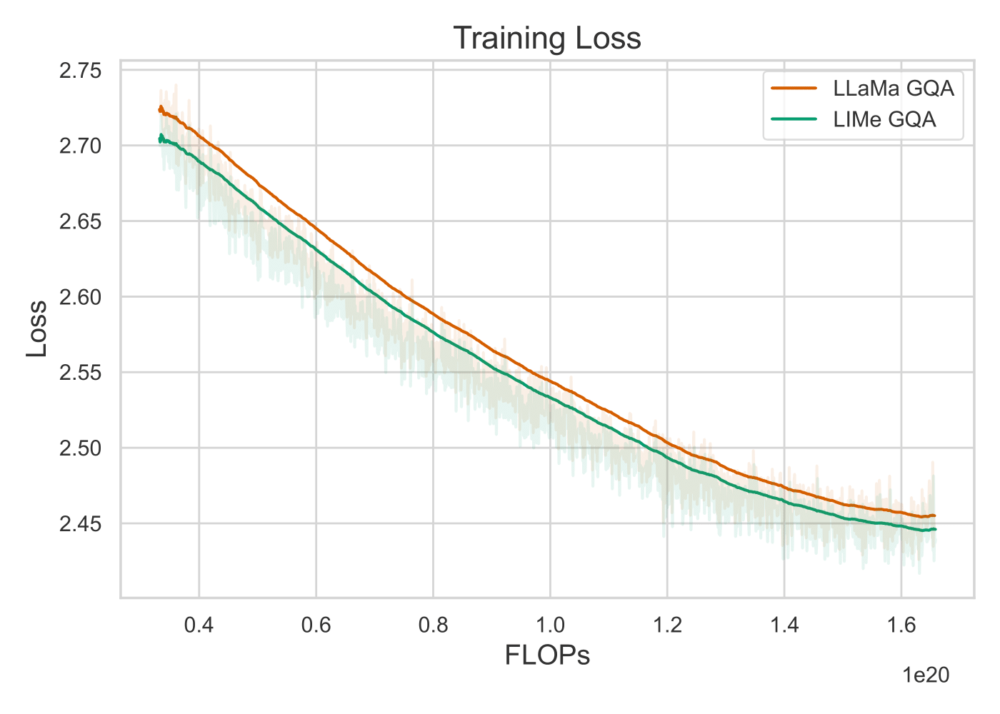
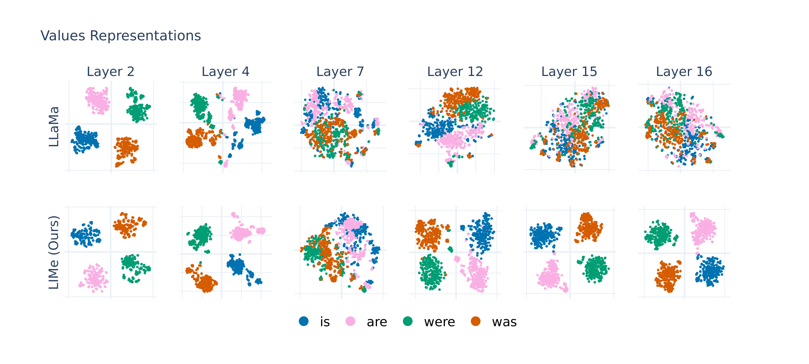

# You Do Not Fully Utilize Transformer's Representation Capacity
[](LICENSE)
[](https://arxiv.org/abs/2502.09245)

Official implementation of the paper ["You Do Not Fully Utilize Transformer's Representation Capacity"](https://arxiv.org/abs/2502.09245).

## About

This repository provides an implementation of Layer-Integrated Memory (LIMe), a lightweight Transformer extension that learns per-head, per-layer routing weights to fuse representations from all previous layers. LIMe mitigates representation collapse, boosts convergence and perplexity-per-FLOP, and delivers significant gains on language modeling, synthetic reasoning benchmarks, and very deep architectures-all with negligible overhead.

## Installation
Clone the repository and install the required dependencies:

```bash
git clone https://github.com/corl-team/lime.git
cd lime
pip install -r requirements.txt
pip install -e .
```

## Dataset Preparation

All the config classes are located in `config.py`. Before start, ensure that you set up `data_path` in `DataConfig`, path to the downloaded dataset. 

Download and preprocess deduplicated FineWeb-Edu dataset.

```bash
python src/datasets/prepare_fineweb.py
```

## Training

Use the following commands to start training:

```bash
export WANDB_API_KEY="YOUR_API_KEY"
export WANDB_ENTITY="YOUR_WANB_ENTITY"

accelerate launch --mixed_precision "bf16" --multi_gpu train.py \
    --config_path /app/configs/config_base.yaml --wandb_config.project "lime"
```
Also, you can add any specific arguments for config classes attributes. Navigate to `config.py` for more information.

<p align="center">
  
</p>

## LM Evaluation Harness benchmarks with 3-shot

| Model    | MultiRC |  WiC   | QNLI  | ARC-E | ARC-C |   KV   | Induction | LD-3  |  Avg  |
|----------|--------:|-------:|------:|------:|------:|-------:|----------:|------:|------:|
| LLaMA    |   43.24 |  50.00 | 49.49 | 70.45 | 38.70 |  45.94 |     54.20 | 33.60 | 48.20 |
| HC       |   54.34 |  49.72 | 49.43 | 71.15 | 37.63 |  51.68 |     51.59 | 33.87 | 49.93 |
| **LIMe** | **56.15** | **50.44** | **51.43** | **71.15** | **39.30** | **55.64** | **55.36** | **34.47** | **51.74** |


## Analysis

All the source code for analysis is stored in `src/analysis/`.



## Citation
```bib
@article{gerasimov2025fullyutilizetransformersrepresentation,
      title={You Do Not Fully Utilize Transformer's Representation Capacity}, 
      author={Gleb Gerasimov and Yaroslav Aksenov and Nikita Balagansky and Viacheslav Sinii and Daniil Gavrilov},
      year={2025},
      eprint={2502.09245},
      archivePrefix={arXiv},
      primaryClass={cs.LG},
      url={https://arxiv.org/abs/2502.09245}, 
}
```