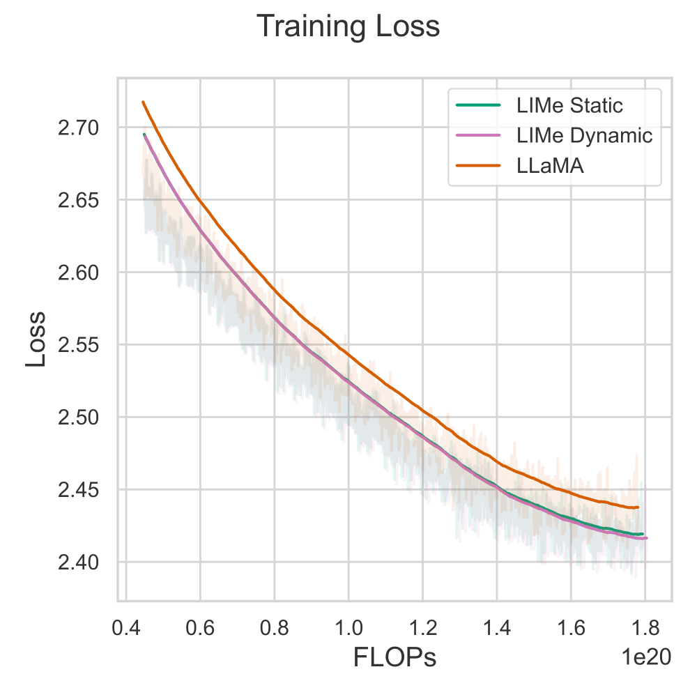
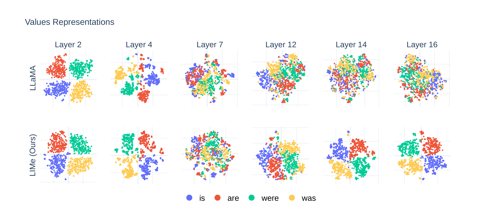

# You Do Not Fully Utilize Transformer's Representation Capacity
[](LICENSE)
[](https://arxiv.org/abs/2502.09245)

This repository contains the official implementation of the paper [“You Do Not Fully Utilize Transformer's Representation Capacity”](https://arxiv.org/abs/2502.09245).

## About

Unlike RNNs, which compress previous tokens into a single hidden state, standard Transformers attend to all previous tokens directly—though using representations only from the immediately preceding layer. We demonstrate that this approach leads to representation collapse and suboptimal performance. Our solution, Layer-Integrated Memory (LIMe), maintains the model’s memory footprint while expanding its representational capacity through controlled access to hidden states from earlier layers. Experiments across various architectures and tasks reveal consistent improvements, and our analysis provides insights into information aggregation in deep networks.

## Installation

Clone the repository and install the required dependencies:

```bash
git clone https://github.com/corl-team/lime.git
cd lime
pip install -r requirements.txt
pip install -e .
```

## Dataset Preparation

All configuration classes are located in `config.py`. Before beginning, ensure that you set the `data_path` attribute in `DataConfig` to the location of your downloaded dataset.

To download and preprocess the deduplicated FineWeb-Edu dataset, run:

```bash
python src/datasets/prepare_fineweb.py
```

## Training

To start training, execute the following commands:

```bash
export WANDB_API_KEY="YOUR_API_KEY"
export WANDB_ENTITY="YOUR_WANB_ENTITY"

accelerate launch --mixed_precision "bf16" --multi_gpu train.py \
    --config_path configs/config_base.yaml --wandb_config.project "lime"
```

To train a deep model, specify the configuration file with the argument `--config configs/config_deep.yaml`. You may also add specific arguments corresponding to the configuration class attributes. For additional details, please refer to `config.py`.

### LM Evaluation Harness Benchmarks on 1.2B Models

| Model            | ARC-E | ARC-C | Winogrande | COPA  | MultiRC | RTE  | HellaSwag | PIQA  | Avg  |
|------------------|-------|-------|------------|-------|---------|------|-----------|-------|------|
| LLaMA            | 69.5  | 38.7  | 55.2       | 75.0  | 42.8    | 54.5 | 53.1      | 72.5  | 57.7 |
| HC               | 70.1  | 38.4  | 53.0       | 77.0  | 42.9    | 51.6 | 54.4      | **73.5**  | 57.6 |
| **LIMe Dynamic** | **72.7**  | **39.5**  | 53.1       | **79.0**  | 43.0    | 52.4 | **54.4**  | 72.9  | **58.4** |
| **LIMe Static**  | 71.1  | 39.3  | **56.2**   | 75.0  | **43.1**| **55.2** | 53.9  | 72.2  | 58.3 |

<p align="center">
  
</p>

## Analysis

All analysis scripts are located in the `src/analysis/` directory:

- **representations.py**: Gathering hidden states and values.
- **classification.py**: Measuring linear separability of similar representations.
- **entropy.py**: Evaluating entropy of representations.
- **dynamic_router_interpret.py**: Interpreting dynamic routers' parameters



## Citation

You can cite our work as:
```bib
@article{lime,
  title={You Do Not Fully Utilize Transformer's Representation Capacity}, 
  author={Gleb Gerasimov and Yaroslav Aksenov and Nikita Balagansky and Viacheslav Sinii and Daniil Gavrilov},
  year={2025},
  eprint={2502.09245},
  archivePrefix={arXiv},
  primaryClass={cs.LG},
  url={https://arxiv.org/abs/2502.09245}, 
}
```